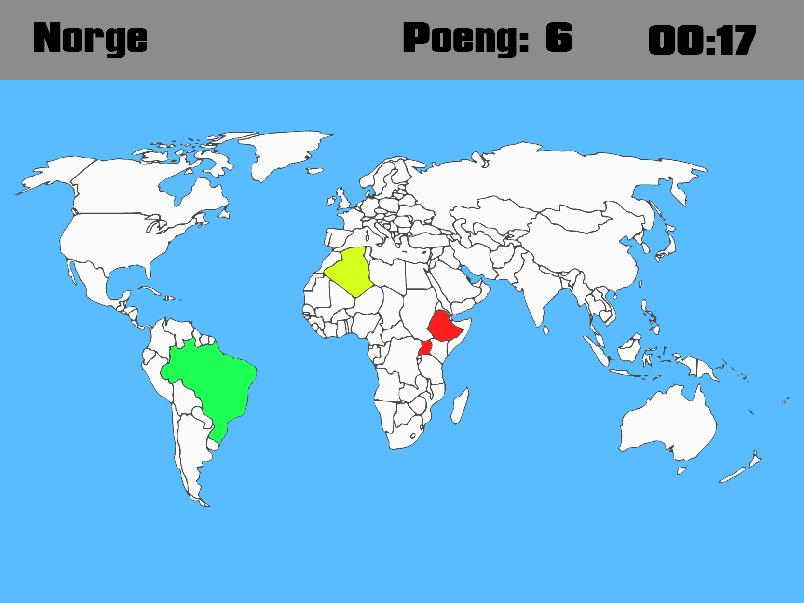
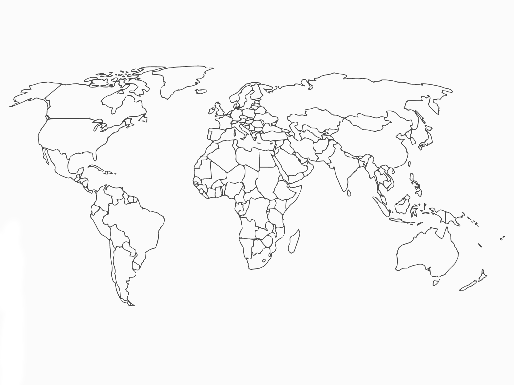

# Historie og Geografi Spill

## Behovsanalyse

#### Hvilke interesser har brukeren?

Brukeren likte historie, geografi og krig og ville lære mer innenfor disse temaene.
Han var interessert i spill og kunne mye om de ulike krigene fra 1900-tallet frem til nå.

## Applikasjon

#### Hva er Spillet?

Spillet skal være et 2D spill hvor man skal plasere land på et blankt kart over verden og får poeng når de gjetter riktig, og kan få tre feil før de må gå videre.

Spillet vil inneholde:
- Kart over verden
- geografi
- poeng
- komboSystem for å få store mengder poeng
- hit %

### Exempel bilder:

## Fremgangsmøte

#### info

Skal lage et 2D spill i unity hvor man skal plasere et land på et blankt kart ut ifra minne.

#### Unity 2D og C#

- Spillet trenger en start side hvor du kan se tider og en start knapp.
- Spillet skal se simpelt ut men fortsatt se bra ut med et minimalistik kart.
- Når man gjetter riktig land/verdensdel får man en poeng sum og får et nytt land man må plasere riktig.
- Det vil også være en timer så man kan se hvor lang tid man bruker.
- Det vil også være en mulighet for å få poeng i tillegg til et kombosystem for å lage det litt mer konkurranse rettet.

Dette er så langt jeg har kommet nå, mer vil komme senere.
